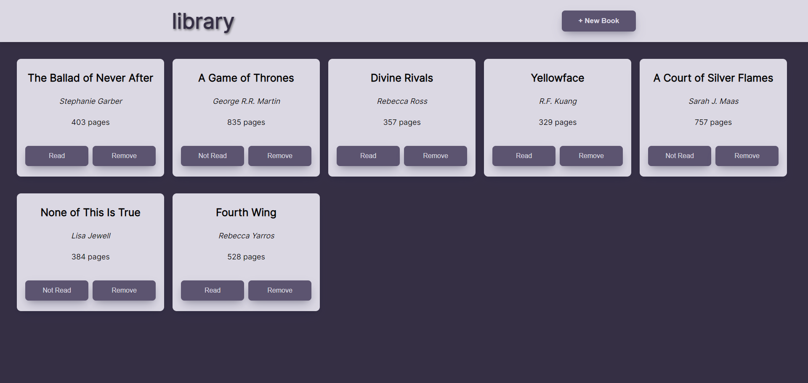

## Table of contents

- [Overview](#overview)
  - [The challenge](#the-challenge)
  - [Screenshots](#screenshots)
- [My process](#my-process)
  - [Built with](#built-with)

## Overview

### The challenge

- Created a library as part of [The Odin Project](https://www.theodinproject.com)
- Live demo: https://itskharina.github.io/Library/

Users should be able to:

- Add and remove books from the library
- Mark book as read or not read
- Still see their books on page refresh

### Screenshots

## My process

### Built with

- Semantic HTML5 markup
- CSS (Flexbox)
- JavaScript
